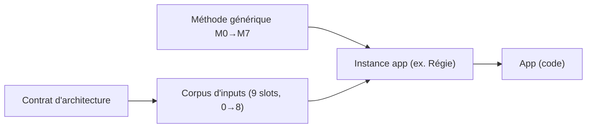
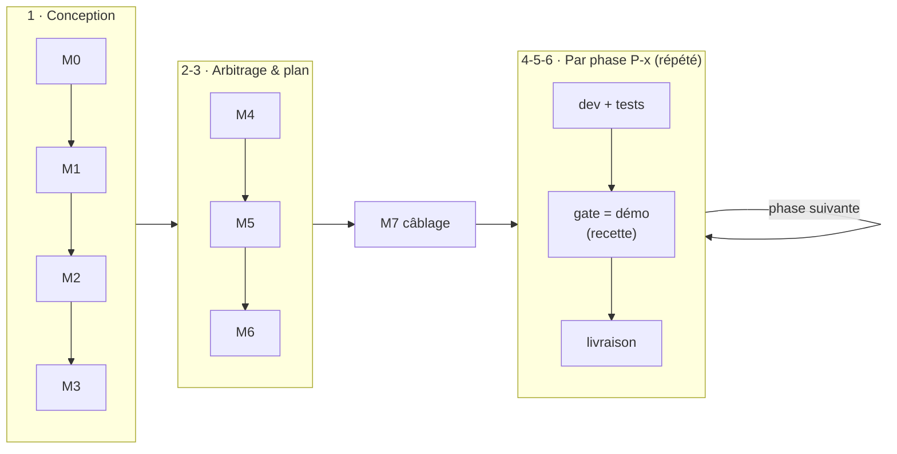

# Méthode LMVI — construire une app TheSocle (générique)

> **Le socle partagé** : la **méthode générique** pour bâtir n'importe quelle app TheSocle, son **corpus
> d'inputs techniques** standard, et le **contrat d'architecture** commun. Une app (ex. Régie) n'est
> qu'une **instance** : elle applique la méthode et **remplit les slots d'inputs**.
> Plateforme de référence : **TheSocle 5.8 (5.8.0)**.

## Contenu

| Élément | Rôle |
|---|---|
| **[`USAGE.md`](USAGE.md)** | **Commencer ici pour un nouveau chantier** : pas-à-pas M0→M7 + les **prompts prêts à coller** par maillon (dont relectures adversariales M1/M4/M6). |
| **[`CONTRAT-ARCHITECTURE.md`](CONTRAT-ARCHITECTURE.md)** | Les règles plateforme que toute app hérite (S3, APIs via Hub, APIM/LLM, minihub, Vault, IAM/SSO, PG THESOCLE, no-mock). **Input #8.** |
| **[`inputs-corpus/`](inputs-corpus/)** | Définition des **9 slots d'inputs (0→8)** techniques (framework, Hub, front, packs, minihub, PG, contrat d'archi) — un sous-dossier par slot. |
| **[`methode/`](methode/)** | **La colonne vertébrale** : la méthode **M0→M7** générique (`METHODE-Besoin2Plan.md` + 10 templates + générateur + prompt). |
| **[`conception/`](conception/)** | Pilier 1 (v1.4) : **RG en fiches · matrice d'habilitations · plan de test** — ce que le client signe côté produit, et sa preuve. Se branche sur M1/M4/M6/P-x. |
| **[`conformite/`](conformite/)** | Pilier 2 (v1.5, périmètre acté) : PV de recette, RGPD, risques, budget/avenants, audit trail — le contractuel & légal. |
| **[`run/`](run/)** | Pilier 3 (v1.6, périmètre acté) : environnements, exploitation, CI/revue, doc/formation — la vie après la livraison. |

## Le principe

## Vue globale — le cycle de vie complet

En termes de phases projet classiques, la chaîne M0→M7 se lit ainsi :

| Phase projet | Maillons | Ce qui s'y passe | Et les tests ? |
|---|---|---|---|
| **1 · Conception** | M0 → M1 → M2 → M3 | vision confirmée, spec (QUOI + RG + NFR), US, épics | les **critères d'acceptation** (M2) s'écrivent ici — c'est la matière des futurs tests, posée **avant tout code** |
| **2 · Arbitrage** | M4 | toutes les décisions structurantes tranchées (spike jetable possible pour instruire une décision) | — |
| **3 · Découpage & plan** | M5 → M6 | phasage gaté, plan technique, matrice de couverture | la **stratégie de test** se décide en M6 : quoi automatisé vs démontré, quoi protège la non-régression |
| **4 · Exécution** (répétée par phase P-x) | M7 puis P-0, P-1… | câblage, puis code par incréments | les tests automatisés s'écrivent **avec** le code (CA → tests) |
| **5 · Recette** | la **gate** de chaque P-x | démo réelle validée par le commanditaire | + re-vérification des gates précédentes (non-régression) |
| **6 · Livraison** | à chaque gate passée | build → registre → déploiement (cible définie en M7) | livraison **incrémentale**, pas de big-bang final |

**La clé** : dev / tests / recette / livraison ne sont **pas** des phases finales du projet — le cycle
en V classique est **replié dans chaque P-x**. Chaque phase est un mini-cycle complet qui se termine
par une recette (la gate) et une livraison réelle. Détails opérationnels : [`USAGE.md`](USAGE.md).

- La **méthode** (M0→M7) et le **corpus d'inputs** sont **génériques** et vivent **ici**.
- Les **3 piliers** (`conception/` · `conformite/` · `run/`) se **branchent** sur la chaîne M0→M7,
  **activables selon le contexte** (déclaré dans le casting M0 : solo = conception au minimum ;
  client = les trois).
- Chaque **app** crée son dossier d'instance (méthode appliquée + `inputs/` rempli + `tracking/`).
- Le **contrat d'architecture** est la source de vérité transversale : aucune app ne le redécide.

## Instances connues
- **Régie (APP-16)** — 1ʳᵉ instance : `APP-16-REGIES/docs/atelier-decomposition/` (méthode M0→M7
  appliquée, `inputs/` rempli, `tracking/PA-0`).

## Statut de mise en place
- ✅ Méthode générique M0→M7 (templates + générateur + prompt) dans [`methode/`](methode/) —
  **kit v1.1.0** (revue Fable appliquée, cf. [`methode/CHANGELOG.md`](methode/CHANGELOG.md) et
  [`AnalyseFable/`](AnalyseFable/)).
- ✅ Corpus d'inputs (9 slots, 0→8) dans [`inputs-corpus/`](inputs-corpus/).
- ✅ Contrat d'architecture.
- ⏳ **Aligner la version** framework **5.8.0 (ligne 5.8)** (input slot #1).
- ℹ️ L'instance Régie (`APP-16-REGIES/…/atelier-decomposition/`) garde sa **copie vendorée** (repo séparé,
  kit v1.0.0) ; cette version-ci est la **canonique générique** à copier pour un nouveau chantier.

## Resync d'une instance

Chaque fichier du kit porte un marqueur `<!-- KIT-VERSION: x.y.z -->` ; une instance copie le kit à
une version donnée. Pour resynchroniser :

1. **Comparer** : lire la `KIT-VERSION` des fichiers de l'instance et le
   [`methode/CHANGELOG.md`](methode/CHANGELOG.md) canonique → lister les versions manquantes.
2. **Reporter** : appliquer à l'instance les changements pertinents de chaque version (le CHANGELOG
   les décrit par change-set) ; toute divergence volontaire est une décision M4 de l'instance.
3. **Marquer** : mettre à jour la `KIT-VERSION` des fichiers resyncés dans l'instance.
