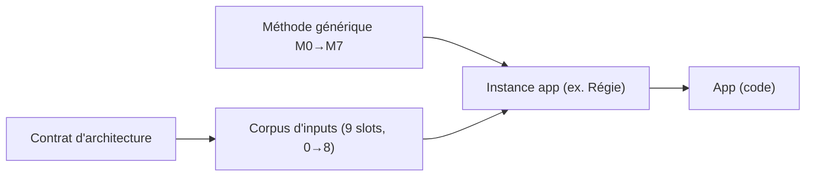

# Méthode LMVI — construire une app TheSocle (générique)

> **Le socle partagé** : la **méthode générique** pour bâtir n'importe quelle app TheSocle, son **corpus
> d'inputs techniques** standard, et le **contrat d'architecture** commun. Une app (ex. Régie) n'est
> qu'une **instance** : elle applique la méthode et **remplit les slots d'inputs**.
> Plateforme de référence : **TheSocle 5.8 (5.8.0)**.

## Contenu

| Élément | Rôle |
|---|---|
| **[`CONTRAT-ARCHITECTURE.md`](CONTRAT-ARCHITECTURE.md)** | Les règles plateforme que toute app hérite (S3, APIs via Hub, APIM/LLM, minihub, Vault, IAM/SSO, PG THESOCLE, no-mock). **Input #8.** |
| **[`inputs-corpus/`](inputs-corpus/)** | Définition des **9 slots d'inputs (0→8)** techniques (framework, Hub, front, packs, minihub, PG, contrat d'archi) — un sous-dossier par slot. |
| **[`methode/`](methode/)** | La méthode **M0→M7** générique : `METHODE-Besoin2Plan.md` + **10 templates** (M0→M7 + fiche US + fiche épic) + **générateur** + **prompt**. |

## Le principe

- La **méthode** (M0→M7) et le **corpus d'inputs** sont **génériques** et vivent **ici**.
- Chaque **app** crée son dossier d'instance (méthode appliquée + `inputs/` rempli + `tracking/`).
- Le **contrat d'architecture** est la source de vérité transversale : aucune app ne le redécide.

## Instances connues
- **Régie (APP-16)** — 1ʳᵉ instance : `APP-16-REGIES/docs/atelier-decomposition/` (méthode M0→M7
  appliquée, `inputs/` rempli, `tracking/PA-0`).

## Statut de mise en place
- ✅ Méthode générique M0→M7 (templates + générateur + prompt) dans [`methode/`](methode/) —
  **kit v1.1.0** (revue Fable appliquée, cf. [`methode/CHANGELOG.md`](methode/CHANGELOG.md) et
  [`AnalyseFable/`](AnalyseFable/)).
- ✅ Corpus d'inputs (9 slots, 0→8) dans [`inputs-corpus/`](inputs-corpus/).
- ✅ Contrat d'architecture.
- ⏳ **Aligner la version** framework **5.8.0 (ligne 5.8)** (input slot #1).
- ℹ️ L'instance Régie (`APP-16-REGIES/…/atelier-decomposition/`) garde sa **copie vendorée** (repo séparé,
  kit v1.0.0) ; cette version-ci est la **canonique générique** à copier pour un nouveau chantier.

## Resync d'une instance

Chaque fichier du kit porte un marqueur `<!-- KIT-VERSION: x.y.z -->` ; une instance copie le kit à
une version donnée. Pour resynchroniser :

1. **Comparer** : lire la `KIT-VERSION` des fichiers de l'instance et le
   [`methode/CHANGELOG.md`](methode/CHANGELOG.md) canonique → lister les versions manquantes.
2. **Reporter** : appliquer à l'instance les changements pertinents de chaque version (le CHANGELOG
   les décrit par change-set) ; toute divergence volontaire est une décision M4 de l'instance.
3. **Marquer** : mettre à jour la `KIT-VERSION` des fichiers resyncés dans l'instance.
