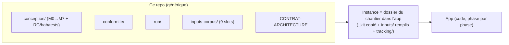

<!-- KIT-VERSION: 1.4.2 -->
# Méthode LMVI — construire une app TheSocle

> La **méthode générique** pour bâtir n'importe quelle app TheSocle (solo ou équipe cliente), avec
> son **corpus d'inputs techniques** et le **contrat d'architecture** commun. Une app (ex. Régie)
> est une **instance** : elle copie le kit et remplit les slots. Plateforme : **TheSocle 5.8**.
>
> 👉 **Pour démarrer un chantier : [`USAGE.md`](USAGE.md)** (pas-à-pas + prompts prêts à coller).

## Le repo en un coup d'œil

```
methode-lmvi/
├── USAGE.md                  ← COMMENCER ICI : le mode d'emploi (pas-à-pas + prompts)
├── CONTRAT-ARCHITECTURE.md   ← les règles plateforme héritées par toute app (jamais redécidées)
├── CHANGELOG.md              ← versions du kit (base du resync des instances)
│
├── conception/               ← PILIER 1 (livré) : concevoir et prouver
│     la chaîne M0→M7 (METHODE + 10 templates + générateur + YAML exemple)
│     + fiches RG · matrice d'habilitations · plan de test
├── conformite/               ← PILIER 2 (v1.5 à venir) : le contractuel & légal
│     PV de recette · RGPD · risques · budget/avenants · audit trail
├── run/                      ← PILIER 3 (v1.6 à venir) : la vie après la livraison
│     environnements · exploitation · CI/revue · doc & formation
│
├── inputs-corpus/            ← les 9 slots d'inputs techniques (0→8) qu'une app instancie
└── AnalyseFable/             ← les revues critiques du kit (archives datées)
```

**Un pilier = une famille d'artefacts**, activée ou non selon le contexte (déclaré dans le casting
M0) : en **solo**, `conception/` suffit ; chez un **client**, on active les trois. La chaîne M0→M7
vit dans `conception/` parce que concevoir est le cœur de la méthode — les deux autres piliers
ajoutent leurs artefacts aux mêmes maillons (ex. le PV de recette s'adosse à la gate d'une phase).

## Comment ça s'articule



## Le cycle de vie d'un chantier

| Étape | Maillons | Ce qui s'y passe | Et les tests ? |
|---|---|---|---|
| **1 · Cadrage & spécification** | M0 → M1 → M2 → M3 | vision confirmée, spec (QUOI + RG + habilitations + NFR), US, épics | la **matière des tests** s'écrit ici : CA des US + exemples/contre-exemples des RG — avant tout code |
| **2 · Arbitrage** | M4 | toutes les décisions structurantes tranchées — **on ne code pas avant** | — |
| **3 · Plan** | M5 → M6 | phasage gaté, plan technique, matrice de couverture (colonne Tests), mapping IAM | le **plan de test** se décide ici : automatisé vs démo, non-régression |
| **4 · Réalisation** (répétée par phase P-x) | M7 puis P-0, P-1… | câblage, puis code par incréments | les tests s'écrivent **avec** le code (squelettes Gherkin générés) |
| **5 · Recette** | la **gate** de chaque P-x | démo réelle validée par le commanditaire | + re-run de toutes les gates précédentes (non-régression) |
| **6 · Livraison** | à chaque gate passée | build → registre → déploiement | incrémentale — jamais de big-bang final |

**La clé** : recette et livraison ne sont pas des étapes finales — le cycle en V est **replié dans
chaque phase P-x**, qui est un mini-cycle complet (dev → tests → recette → livraison).

## Instances connues
- **Régie (APP-16)** — 1ʳᵉ instance : `APP-16-REGIES/docs/atelier-decomposition/` (kit v1.0.0
  vendoré, à resynchroniser).

## Resync d'une instance

Chaque fichier du kit porte `<!-- KIT-VERSION: x.y.z -->` ; une instance copie le kit à une version
donnée (dossier `_kit/`). Pour resynchroniser :
1. **Comparer** la `KIT-VERSION` de l'instance au [`CHANGELOG.md`](CHANGELOG.md) → versions manquantes.
2. **Reporter** les changements pertinents (décrits par version) ; toute divergence volontaire = décision M4 de l'instance.
3. **Marquer** la nouvelle `KIT-VERSION` dans l'instance.

## Reste à faire
- ⏳ Piliers `conformite/` (v1.5) et `run/` (v1.6) — périmètres actés dans leurs README.
- ⏳ Aligner le slot #1 du corpus sur la version framework 5.8.x exacte.
