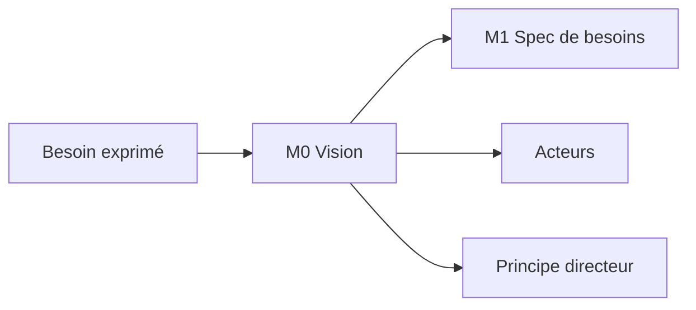

<!-- KIT-VERSION: 1.4.0 -->
<!-- PROUVE-SUR: Régie/atelier-décomposition (kit v1.0) -->
# M0 · Vision — {{nom du chantier}}

> Template. Remplacer les `{{…}}`. **DoD** : le commanditaire dit « oui, c'est ça ».

## 1. Rôle
Cadrer le **pourquoi** avant tout : problème, valeur, principe directeur.

## 2. Entrée
Ce que dit le commanditaire (oral, désordonné) : `{{verbatim / notes}}`.

## 3. Livrable
- **Vision (3–5 lignes)** : `{{résumé}}`
- **Principe directeur** : `{{la règle qui prime en cas de doute}}`
- **Acteurs** (personas métier) : `{{acteur → ce qu'il fait}}` — donneront les **rôles métier**
  (habilitations, pilier conception) : un acteur ≠ un rôle, une personne cumule des rôles.
- **Casting du chantier** (une personne peut cumuler ; en solo, les agents IA prennent des rôles) :

  | Rôle | Qui | Responsabilité |
  |---|---|---|
  | Commanditaire | `{{…}}` | valide M0, tranche M4, recette les gates |
  | Relecteur(s) | `{{humain(s) et/ou agent IA adversarial}}` | relecture requise M1 / M4 / M6 |
  | Métier / PO | `{{…}}` | signe RG + matrice d'habilitations |
  | Dev(s) | `{{…}}` | code + tests des P-x |
  | Recetteur | `{{…}}` | déroule la gate (démo + suites) |

- **Piliers activés** : conception `{{oui}}` · conformité `{{oui/non — contexte client}}` ·
  run `{{oui/non}}` (cf. les README des piliers à la racine du kit)

## 4. Relations (mermaid)

## 5. Contenu
`{{vision détaillée, acteurs, principe}}`

## 6. Definition of Done
- [ ] Vision reformulée **et confirmée** par le commanditaire
- [ ] Acteurs listés
- [ ] Principe directeur écrit
- [ ] Casting complet (aucun rôle sans titulaire) + piliers activés déclarés
