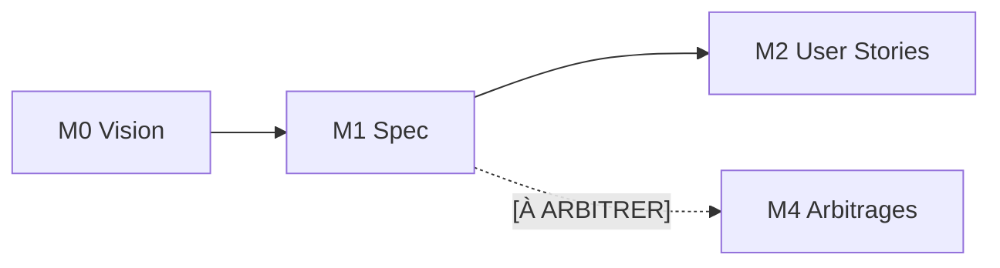
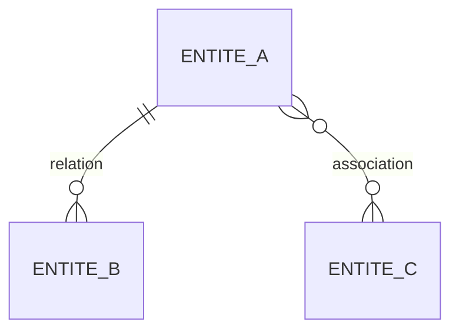

<!-- KIT-VERSION: 1.1.0 -->
<!-- PROUVE-SUR: Régie/atelier-décomposition (kit v1.0) -->
# M1 · Spec de besoins — {{nom du chantier}}

> Template. **QUOI, jamais le comment.** DoD : un tiers comprend le domaine sans voir le code.
> **Relecture requise** (méthode §1) avant de passer à M2.

## 1. Rôle
Décrire le besoin : concepts, entités, règles de gestion, contrat métier, exigences non fonctionnelles.

## 2. Entrée
La **Vision** (M0).

## 3. Livrable
`SPEC-{{XXX}}.md` avec : concepts & vocabulaire · modèle d'entités · règles de gestion (RG) ·
exigences non fonctionnelles · points `[À ARBITRER]` · section **Révisions** (rétro-propagation, méthode §2.2).

## 4. Relations (mermaid)

Modèle d'entités (à adapter) :

## 5. Contenu
- **Concepts** : `{{glossaire}}`
- **Entités** : `{{type → champs de base + champs libres}}`
- **RG** : `{{RG-1, RG-2…}}`
- **Exigences non fonctionnelles** : volumétrie `{{…}}` · latence `{{…}}` · coût par run (LLM inclus)
  `{{…}}` · rétention `{{…}}` · quotas `{{…}}` — « N/A » accepté **si justifié**
- **[À ARBITRER]** : `{{Q-1, Q-2…}}`
- **Révisions** : `{{date — quoi — pourquoi (vide au départ)}}`

## 6. Definition of Done
- [ ] Tous les termes définis une fois
- [ ] Modèle d'entités posé (+ mermaid)
- [ ] Exigences non fonctionnelles posées (ou N/A justifié)
- [ ] Chaque point non tranché marqué `[À ARBITRER]`
- [ ] La spec **complète** l'existant (ne l'écrase pas)
- [ ] **Relecture faite** (relecteur défini en M0)
