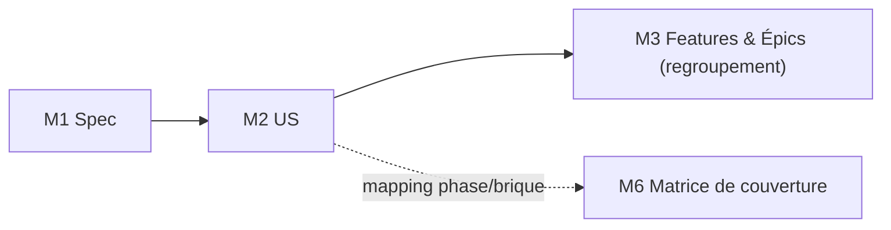

<!-- KIT-VERSION: 1.8.0 -->
<!-- PROUVE-SUR: — (niveau Feature v1.8 non prouvé ; chaîne de base prouvée sur Régie kit v1.0) -->
# M2 · User Stories — {{nom du chantier}}

> Template. Une US = une intention **testable**, sans solution technique.
> **La fiche US ne porte ni phase ni brique** — ce rattachement vit dans la matrice de couverture (M6).

## 1. Rôle
Décliner le besoin en énoncés vérifiables (axe MÉTIER uniquement).

## 2. Entrée
La **Spec** (M1).

## 3. Livrable
Liste d'US numérotées + **critères d'acceptation** sur les pivots (1 fiche par US, cf. `TEMPLATE-US.md`).

## 4. Relations (mermaid)

## 5. Contenu (gabarit d'US)
| ID | En tant que… | je veux… | afin de… | Critères d'acceptation |
|----|--------------|----------|----------|------------------------|
| `{{X1}}` | `{{acteur}}` | `{{capacité}}` | `{{bénéfice}}` | `{{CA-1 ; CA-2}}` |

## 6. Definition of Done
- [ ] US **testables** et **numérotées**
- [ ] Aucune solution technique dans l'énoncé
- [ ] Critères d'acceptation sur les US pivots
- [ ] Aucune fiche US ne porte de phase ni de brique (axe métier seul)
