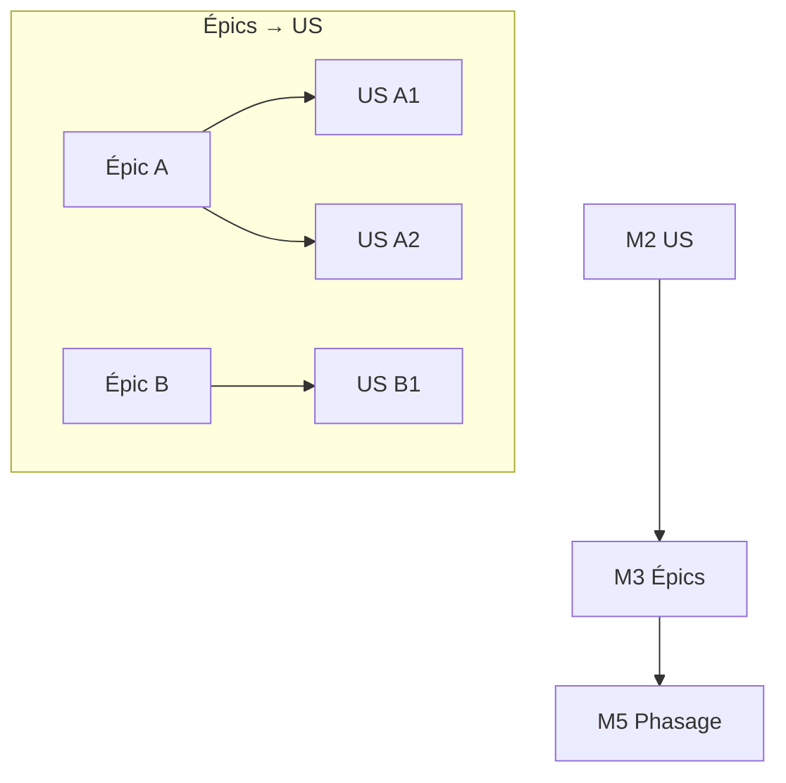

<!-- KIT-VERSION: 1.1.0 -->
<!-- PROUVE-SUR: Régie/atelier-décomposition (kit v1.0) -->
# M3 · Épics — {{nom du chantier}}

> Template. L'épic **regroupe** des US par axe de valeur. Relation de regroupement, pas étape stricte.
> **US transverse** : un seul épic **propriétaire** (celui de la matrice M6) ; épics secondaires
> possibles via les tags `epic/x` du frontmatter de la fiche US.

## 1. Rôle
Organiser les US en thèmes métier (axe MÉTIER).

## 2. Entrée
Les **User Stories** (M2).

## 3. Livrable
Les US rangées en épics ; chaque US a **un** épic propriétaire ; aucun épic vide.

## 4. Relations (mermaid)

## 5. Contenu
| Épic | Intention | US regroupées |
|---|---|---|
| `{{A}}` | `{{thème}}` | `{{A1, A2…}}` |

## 6. Definition of Done
- [ ] Toute US a exactement un épic **propriétaire**
- [ ] Aucun épic vide
- [ ] Graphe épic → US à jour
