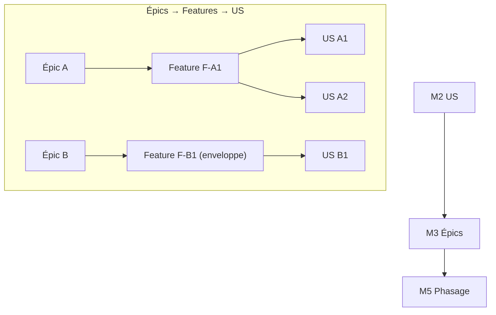

<!-- KIT-VERSION: 1.8.0 -->
<!-- PROUVE-SUR: — (niveau Feature v1.8 non prouvé ; chaîne de base prouvée sur Régie kit v1.0) -->
# M3 · Features & Épics — {{nom du chantier}}

> Template. Le regroupement métier a **deux étages, obligatoires** : l'**épic** (thème de valeur)
> regroupe des **features** (capacités démontrables d'un bloc), qui regroupent les US. Petit
> chantier → au minimum une **feature-enveloppe** par épic (même périmètre, déclarée comme telle).
> Relation de regroupement, pas étape stricte. **US transverse** : une seule feature
> **propriétaire** (l'épic propriétaire = celui de la feature, c'est lui que compte la matrice
> M6) ; regroupements secondaires via les tags `feature/x` / `epic/x` du frontmatter.

## 1. Rôle
Organiser les US en features, et les features en thèmes métier (axe MÉTIER).

## 2. Entrée
Les **User Stories** (M2).

## 3. Livrable
Les US rangées en features (fiche par feature, `TEMPLATE-FEATURE.md`), les features en épics ;
chaque US a **une** feature propriétaire, chaque feature **un** épic ; aucune vide.

## 4. Relations (mermaid)

## 5. Contenu
| Épic | Feature | Intention | US regroupées |
|---|---|---|---|
| `{{A}}` | `{{F-A1}}` | `{{capacité démontrable}}` | `{{A1, A2…}}` |

## 6. Definition of Done
- [ ] Toute US a exactement une feature **propriétaire** ; toute feature exactement un épic
- [ ] Aucune feature ni aucun épic vide (feature-enveloppe déclarée comme telle)
- [ ] Graphe épic → feature → US à jour
