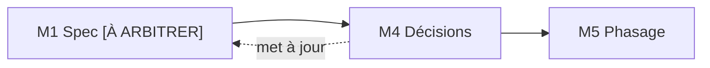

<!-- KIT-VERSION: 1.1.0 -->
# M4 · Arbitrages — {{nom du chantier}}

> Template. **On ne passe pas au plan tant qu'une décision structurante est ouverte.**
> **Relecture requise** (méthode §1). Accueille aussi les raisons d'abandon d'US (méthode §2.3).

## 1. Rôle
Trancher les `[À ARBITRER]` de M1 et les questions ouvertes.

## 2. Entrée
Les points ouverts de la **Spec** (M1).

## 3. Livrable
Journal de décisions : option retenue + **pourquoi**, rapatrié dans la spec.

## 4. Relations (mermaid)

## 5. Contenu
| # | Question | Options | **Décision** | Pourquoi | Impact |
|---|----------|---------|--------------|----------|--------|
| `{{Q-1}}` | `{{…}}` | `{{A / B / C}}` | `{{B}}` | `{{raison}}` | `{{ce que ça contraint}}` |

## 6. Definition of Done
- [ ] Plus aucune décision **bloquante** ouverte
- [ ] Décisions **écrites** (pas dans les têtes) et reportées dans la spec
- [ ] **Relecture faite** (relecteur défini en M0)
