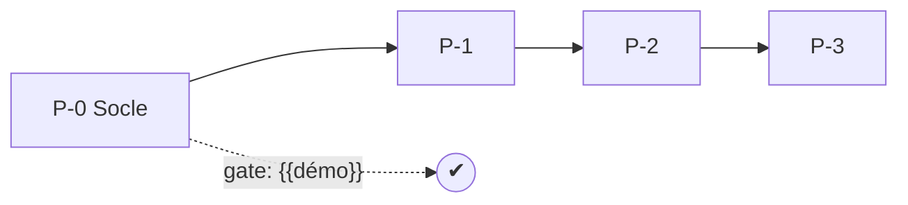

<!-- KIT-VERSION: 1.1.0 -->
# M5 · Phasage gaté — {{nom du chantier}}

> Template. Une phase = un lot d'épics/US livré ensemble, avec une **gate = démo vérifiable**.
> **Convention de nommage des phases** : `{{préfixe}}` (`P-x` par défaut ; une instance peut choisir
> un autre préfixe) — **unique** pour le chantier, déclaré ici.

## 1. Rôle
Ordonner la livraison en incréments démontrables (axe LIVRAISON).

## 2. Entrée
**Épics** (M3) + **Décisions** (M4).

## 3. Livrable
Phases `P-0…P-n`, chacune avec contenu (épics/US) + **gate**. Estimation : ré-estimer × 2
*(⚗️ règle candidate, méthode §1·M5)*.

## 4. Relations (mermaid)

## 5. Contenu
| Phase | Contenu (épics/US) | Gate (démo) |
|---|---|---|
| `{{P-0}}` | `{{…}}` | `{{« on voit X marcher »}}` |

## 6. Definition of Done
- [ ] Chaque phase apporte de la valeur **démontrable** seule
- [ ] `P-0` = socle qui débloque le reste *(⚗️ règle candidate)*
- [ ] Chaque gate formulée comme une **démo**, pas une tâche
- [ ] Préfixe de phase déclaré (une seule convention pour le chantier)
