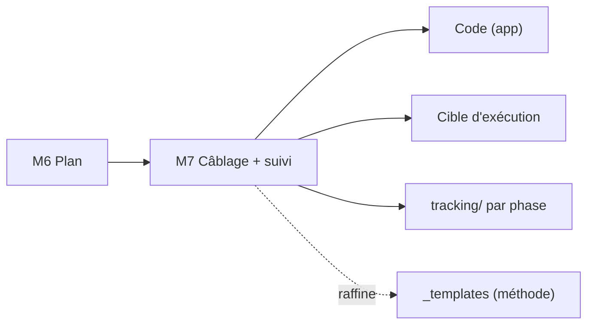

<!-- KIT-VERSION: 1.1.0 -->
<!-- PROUVE-SUR: Régie/atelier-décomposition (kit v1.0) -->
# M7 · Exécution & câblage — {{nom du chantier}}

> Template. **Le pont entre le plan (M6) et le code.** Répond à : *où* le code, *quels* inputs, *quels*
> outils plateforme, *quelle* cible d'exécution, et *comment on suit* chaque phase.

## 1. Rôle
Rendre l'exécution **concrète et reproductible** : emplacements, inputs, outils, cible, suivi.

## 2. Entrée
**Phasage** (M5) + **Plan technique** (M6).

## 3. Câblage

### 3.1 Où va le code
- **App / module** : `{{chemin de l'app}}` — nouveaux packages `{{…}}`, SQL `{{…}}`, frontend `{{…}}`.
- **Repo source de vérité** : `{{github…}}`.

### 3.2 Inputs techniques (dont on s'inspire / qu'on réutilise)
| Input | Emplacement | Rôle |
|---|---|---|
| Framework / socle | `{{jar + docs}}` | patterns, invariants |
| Packs réutilisés | `{{chemin}}` | briques (pipeline, …) |
| Apps de référence | `{{…}}` | modèles concrets |
| Spec/plan du chantier | `{{docs/…}}` | le *quoi* + mapping briques |

### 3.3 Outils plateforme (Hub / MCP) utilisés
{{db_worker (schéma), iam (tenant/rôles), vault (secrets), storage, APIM/LLM, proxy, install…}}

### 3.4 Cible d'exécution
{{où ça tourne : hôte/minihub, base, storage, endpoints}} — **build → registre → déploiement**.

## 4. Suivi par phase (live-tracking)
Un dossier `tracking/{{P-x}}/` par phase, avec :
`STATE.md` (où on en est) · `JOURNAL.md` (chronologie) · `BLOCKERS.md` · `DECISIONS.md` · `tasks/`.
**Preuve à chaque gate** : démo réelle de la phase **+ re-vérification des gates précédentes**
(re-démo rapide ou suite de tests définie en M6.5), **zéro mock**. Gate échouée → méthode §2.1
(la phase ne se ferme pas ; BLOCKERS + décision journalisée).

## 5. Relations (mermaid)

## 6. Definition of Done
- [ ] Emplacement du code + repo connus
- [ ] Inputs & outils plateforme listés
- [ ] Cible d'exécution + procédure build/deploy définies
- [ ] Dossier de suivi de la 1ʳᵉ phase créé
