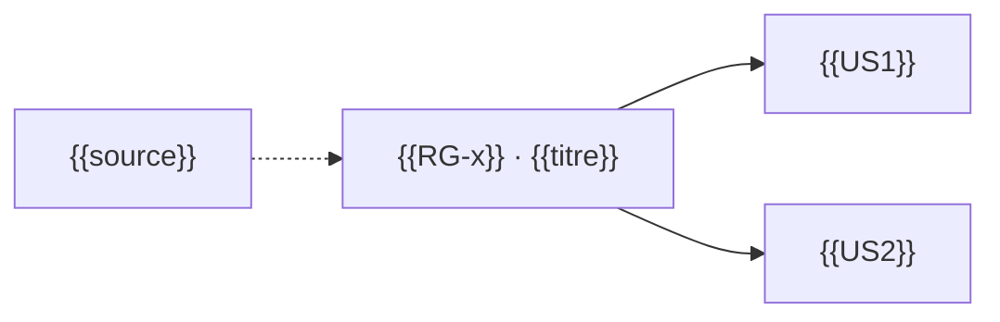

<!-- KIT-VERSION: 1.4.0 -->
---
aliases: ["{{RG-x}}"]
tags: [rg, "type/{{type}}"]
---
# {{RG-x}} · {{titre court}}

> Template d'une **fiche règle de gestion** (1 fichier par RG, dans `M1-spec-besoins/RG/`).
> Nom de fichier = `{{RG-x}}-{{slug}}.md`. La RG est du **QUOI** (elle appartient à la spec M1) ;
> les décisions M4 la créent ou la modifient ; les tests `@{{RG-x}}` la prouvent.
> **Jamais supprimée** : une RG retirée passe en statut `abrogée` avec sa raison.

| | |
|---|---|
| **Code** | `{{RG-x}}` (identifiant stable) |
| **Énoncé** | {{la règle, une phrase impérative et testable}} |
| **Type** | {{invariant · calcul · contrainte · droit_acces · workflow}} |
| **Source** | {{vision M0 / décision M4 Q-n / exigence client du JJ-MM}} |
| **Statut** | active *(cycle : active · modifiée le {{date}} (cf. M4 Q-n) · abrogée le {{date}}, raison)* |
| **US concernées** | {{[[A1-slug]] · [[C2-slug]] …}} |
| **Tests** | `@{{RG-x}}` — {{emplacement des tests qui la prouvent}} |

## Détail
{{2–5 phrases : le pourquoi de la règle, son périmètre exact, ses limites.}}

## Exceptions
- {{exception 1 — ou « aucune »}}

## Exemples (cas conformes) / Contre-exemples (cas rejetés)
| ✅ Conforme | ⛔ Rejeté |
|---|---|
| {{exemple concret 1}} | {{contre-exemple concret 1}} |
| {{exemple concret 2}} | {{contre-exemple concret 2}} |

> Chaque ligne de ce tableau = un scénario de test `@{{RG-x}}` (le générateur produit les squelettes).

## Si type = `droit_acces`
Condition fine appliquée **dans le code** (pas dans l'IAM — doctrine pilier conception) :
{{qui, sur quoi, sous quelle condition — ex. « un {{rôle}} ne modifie que SES {{objets}} »}}.
Référencée par les cellules ⚠️ de la [matrice d'habilitations](TEMPLATE-HABILITATIONS.md).

## Si type = `calcul` ou `workflow` (optionnel)
Exécutable via : {{modèle JDM `repository/decisions/…` / service — ou « code simple, pas de moteur »}}.

## Relations (mermaid)

