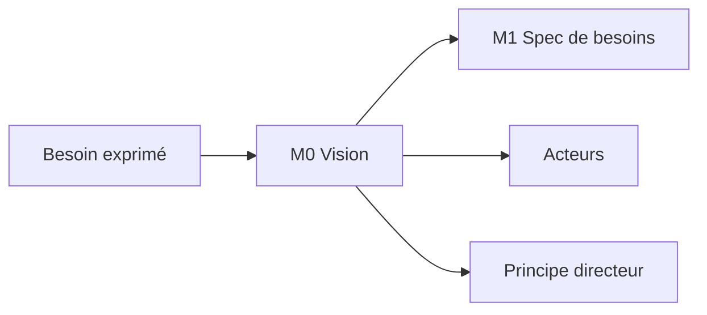

<!-- KIT-VERSION: 1.1.0 -->
# M0 · Vision — {{nom du chantier}}

> Template. Remplacer les `{{…}}`. **DoD** : le commanditaire dit « oui, c'est ça ».

## 1. Rôle
Cadrer le **pourquoi** avant tout : problème, valeur, principe directeur.

## 2. Entrée
Ce que dit le commanditaire (oral, désordonné) : `{{verbatim / notes}}`.

## 3. Livrable
- **Vision (3–5 lignes)** : `{{résumé}}`
- **Principe directeur** : `{{la règle qui prime en cas de doute}}`
- **Acteurs** : `{{rôle → ce qu'il fait}}`
- **Rôles du chantier** : commanditaire = `{{qui valide}}` · relecteur = `{{qui relit M1/M4/M6 ;
  en solo : un agent IA en revue adversariale}}`

## 4. Relations (mermaid)

## 5. Contenu
`{{vision détaillée, acteurs, principe}}`

## 6. Definition of Done
- [ ] Vision reformulée **et confirmée** par le commanditaire
- [ ] Acteurs listés
- [ ] Principe directeur écrit
- [ ] Rôles commanditaire / relecteur définis
