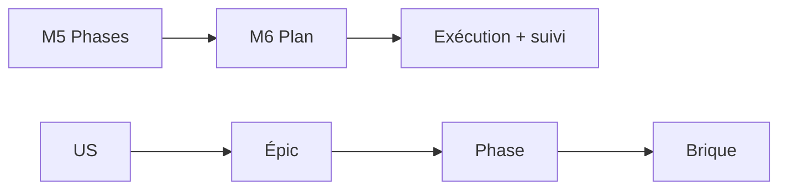

<!-- KIT-VERSION: 1.1.0 -->
# M6 · Plan technique + matrice de couverture — {{nom du chantier}}

> Template. Choisir les briques **par nature** (arbre V005), **jamais par épic**. Réutiliser la plateforme.
> La matrice est la **seule source de vérité** du mapping US→phase→brique (méthode §0).
> **Relecture requise** (méthode §1).

## 1. Rôle
Traduire chaque phase en briques techniques + prouver la couverture.

## 2. Entrée
**Phasage** (M5) + **Spec** (M1).

## 3. Livrable (par phase)
1. **Réutilisation plateforme** (ce qu'on NE code pas) · 2. **Briques nouvelles**
(worker/service/stage/package) · 3. **Modèle de données** · 4. **Matrice de couverture** ·
5. **Stratégie de test** : CA couverts par test automatisé vs démo manuelle + tests protégeant la
**non-régression des gates précédentes**.

## 4. Relations (mermaid)

## 5. Matrice de couverture (le garde-fou)
| US | Épic | Phase | Brique technique | Gate | Statut / révisé le |
|----|------|-------|------------------|------|--------------------|
| `{{X1}}` | `{{A}}` | `{{P-0}}` | `{{service/stage/worker}}` | `{{démo}}` | `{{à faire}}` |

## 6. Definition of Done
- [ ] Chaque US tracée jusqu'à une brique (aucune orpheline)
- [ ] Aucune brique sans US
- [ ] Réutilisation plateforme explicitée · **zéro mock**
- [ ] Stratégie de test posée (dont non-régression des gates précédentes)
- [ ] **Relecture faite** (relecteur défini en M0)
